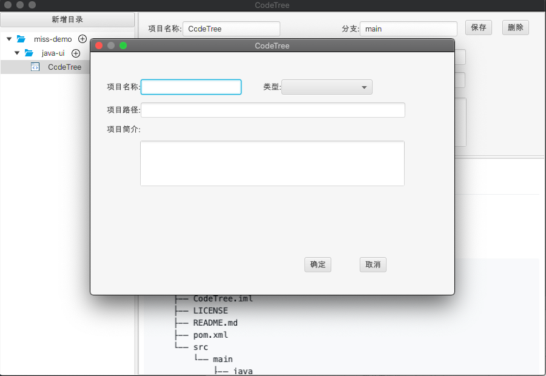

# CodeTree

*codeTree 是一个使用javafx 开发的本地项目和代码仓库管理工具。*

### CodeTree's codeTree

```shell
.
└── CodeTree
    ├── CodeTree.iml
    ├── LICENSE
    ├── README.md
    ├── pom.xml
    └── src
        └── main
            ├── java
            │   ├── com
            │   │   └── miss
            │   │       └── codetree
            │   └── module-info.java
            └── resources
                ├── com
                │   └── miss
                │       └── codetree
                ├── config.json
                ├── icon
                │   ├── add.png
                │   ├── expandImage.png
                │   ├── foldImage.png
                │   ├── pressedAdd.png
                │   └── project.png
                └── static
                    ├── css
                    │   ├── github-markdown.css
                    │   └── index.min.css
                    ├── index.html
                    └── js
                        ├── index.min.js
                        ├── plugin-gfm.js
                        └── plugin-highlight.js
```

### 版本说明

- JavaFx 16
- openjdk version "16.0.2" 2021-07-20
- Apache Maven 3.6.3


### feature

- [x] 菜单树展示和折叠收起
- [x] 详情面板开发
- [x] git仓库信息获取和展示
- [x] README的文件展示
- [x] 添加新项目弹窗
- [x] 允许调整目录结构，上下级

### 示例图

- CodeProject Detail


- Add A New CodeProject

